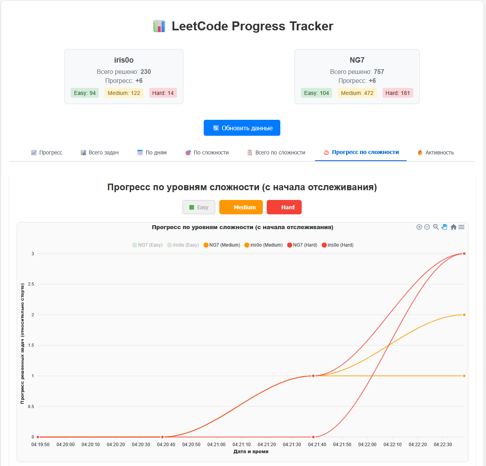

# 📊 LeetCode Progress Tracker

<div align="center">




</div>

> Система для отслеживания прогресса решения задач на LeetCode с красивым веб-интерфейсом и графиками.

## ✨ Особенности

- 📈 Интерактивные графики прогресса
- 👥 Сравнение нескольких пользователей
- 🎯 Отслеживание по уровням сложности (Easy, Medium, Hard)
- 🔄 Автоматическое обновление данных
- 🌐 Современный веб-интерфейс
- 📱 Адаптивный дизайн

## Компоненты

### 1. Скрипт сбора данных (`data_collector.py`)
Собирает статистику пользователей LeetCode и сохраняет в CSV файл.

### 2. Веб-приложение (`app.py`)
FastAPI приложение для отображения графиков и статистики.

### 3. Конфигурация (`config.py`)
Настройки для обоих компонентов.

## 🚀 Быстрый старт

### 1. Установка зависимостей

```bash
pip install -r requirements.txt
```

### 2. Настройка пользователей

Отредактируйте `config.py` и укажите нужных пользователей LeetCode:

```python
USERNAMES = ["your_username", "friend_username"]
```

### 3. Сбор данных

```bash
python data_collector.py
```

💡 **Совет**: Настройте автоматический запуск для регулярного обновления данных.

### 4. Запуск веб-приложения

```bash
python app.py
```

Или используя uvicorn:

```bash
uvicorn app:app --host 0.0.0.0 --port 8000 --reload
```

🌐 Откройте браузер: http://localhost:8000

## 📋 API Endpoints

| Endpoint | Описание |
|----------|----------|
| `GET /` | Главная страница с графиками |
| `GET /plot/progress` | График прогресса (PNG) |
| `GET /plot/total` | График общего количества (PNG) |
| `GET /api/stats` | Статистика в JSON |

## ⚙️ Настройка конфигурации

В файле `config.py` настройте основные параметры:

```python
# Пользователи LeetCode для отслеживания
USERNAMES = ["your_username", "friend_username"]

# Файлы данных
CSV_FILE = "leetcode_progress.csv"

# Настройки запросов
REQUEST_TIMEOUT = 10  # Таймаут в секундах
```

## 🔄 Автоматизация

Для автоматического обновления данных настройте запуск `data_collector.py`:

### Windows (Task Scheduler)
1. Откройте Task Scheduler
2. Создайте новую задачу
3. Установите расписание (например, каждый час)
4. Укажите команду: `python "path\to\your\data_collector.py"`

### Linux/macOS (cron)
```bash
# Добавить в crontab для запуска каждый час
0 * * * * cd /path/to/project && python data_collector.py
```

## 📁 Структура проекта

```
leetcode-graph/
├── 📄 app.py                        # Веб-приложение FastAPI
├── 📊 data_collector.py             # Скрипт сбора данных
├── ⚙️ config.py                     # Конфигурация
├── 📋 requirements.txt              # Python зависимости
├── 📈 leetcode_progress.csv         # Данные (автоматически)
├── 📂 modules/                      # Модули приложения
│   ├── api_routes.py               # API маршруты
│   ├── chart_creator.py            # Создание графиков
│   ├── data_processor.py           # Обработка данных
│   └── web_views.py                # Веб-представления
├── 📂 static/                       # Статические файлы
│   ├── css/style.css               # Стили
│   └── js/app.js                   # JavaScript
└── 📂 templates/                    # HTML шаблоны
    ├── index.html                  # Главная страница
    └── error.html                  # Страница ошибки
```

## ⚙️ Настройка конфигурации

В файле `config.py` настройте основные параметры:

```python
# Пользователи LeetCode для отслеживания
USERNAMES = ["your_username", "friend_username"]

# Файлы данных
CSV_FILE = "leetcode_progress.csv"

# Настройки запросов
REQUEST_TIMEOUT = 10  # Таймаут в секундах
```

## API Endpoints

- `GET /` - Главная страница с графиками
- `GET /plot/progress` - График прогресса (PNG)
- `GET /plot/total` - График общего количества (PNG)
- `GET /api/stats` - Статистика в JSON формате

## ❗ Решение проблем

### Пользователь не найден
Убедитесь, что имена пользователей в `config.py` указаны правильно и соответствуют профилям на LeetCode.

### Файл с данными не найден  
Запустите `data_collector.py` хотя бы один раз для создания файла с данными.

### Проблемы с графиками
Убедитесь, что установлены все зависимости из `requirements.txt`.

---

## 📝 Лицензия

MIT License

## 🤝 Вклад в проект

Приветствуются Pull Request'ы и Issues! Не стесняйтесь предлагать улучшения.

## ⭐ Поддержка

Если проект оказался полезным, поставьте звездочку! ⭐
