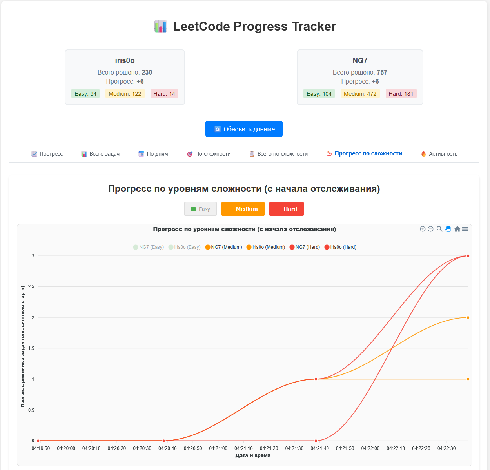

# 📊 LeetCode Progress Tracker

<div align="center">



[](README_en.md)
[](README_ru.md)

</div>

> A system for tracking LeetCode problem-solving progress with a beautiful web interface and charts.

## ✨ Features

- 📈 Interactive progress charts
- 👥 Multiple user comparison
- 🎯 Difficulty level tracking (Easy, Medium, Hard)
- 🔄 Automatic data updates
- 🌐 Modern web interface
- 📱 Responsive design
- 🌍 Multi-language support (Russian/English)

## Components

### 1. Data Collection Script (`data_collector.py`)
Collects LeetCode user statistics and saves them to a CSV file.

### 2. Web Application (`app.py`)
FastAPI application for displaying charts and statistics.

### 3. Configuration (`config.py`)
Settings for both components.

## 🚀 Quick Start

### 1. Install Dependencies

```bash
pip install -r requirements.txt
```

### 2. Configure Users

Edit `config.py` and specify the LeetCode users you want to track:

```python
USERNAMES = ["your_username", "friend_username"]
```

### 3. Data Collection

```bash
python data_collector.py
```

💡 **Tip**: Set up automatic execution for regular data updates.

### 4. Run Web Application

```bash
python app.py
```

Or using uvicorn:

```bash
uvicorn app:app --host 0.0.0.0 --port 8000 --reload
```

🌐 Open browser: http://localhost:8000

## 📋 API Endpoints

| Endpoint | Description |
|----------|-------------|
| `GET /` | Main page with charts |
| `GET /plot/progress` | Progress chart (PNG) |
| `GET /plot/total` | Total count chart (PNG) |
| `GET /api/stats` | Statistics in JSON |

## ⚙️ Configuration Setup

Configure basic parameters in `config.py`:

```python
# LeetCode users to track
USERNAMES = ["your_username", "friend_username"]

# Data files
CSV_FILE = "leetcode_progress.csv"

# Request settings
REQUEST_TIMEOUT = 10  # Timeout in seconds
```

## 🔄 Automation

For automatic data updates, set up scheduled execution of `data_collector.py`:

### Windows (Task Scheduler)
1. Open Task Scheduler
2. Create a new task
3. Set schedule (e.g., every hour)
4. Specify command: `python "path\to\your\data_collector.py"`

### Linux/macOS (cron)
```bash
# Add to crontab to run every hour
0 * * * * cd /path/to/project && python data_collector.py
```

## 📁 Project Structure

```
leetcode-graph/
├── 📄 app.py                        # FastAPI web application
├── 📊 data_collector.py             # Data collection script
├── ⚙️ config.py                     # Configuration
├── 📋 requirements.txt              # Python dependencies
├── 🔒 pyproject.toml                # Project metadata
├── 📈 leetcode_progress.csv         # Data (automatically generated)
├── 📂 modules/                      # Application modules
│   ├── __init__.py
│   ├── api_routes.py               # API routes
│   ├── chart_creator.py            # Chart creation
│   ├── data_processor.py           # Data processing
│   ├── i18n.py                     # Internationalization
│   ├── utils.py                    # Utilities
│   └── web_views.py                # Web views
├── 📂 static/                       # Static files
│   ├── css/style.css               # Styles
│   └── js/app.js                   # JavaScript
├── 📂 templates/                    # HTML templates
│   ├── index.html                  # Main page
│   └── error.html                  # Error page
├── 📂 locales/                      # Translations
│   ├── en.json                     # English translations
│   └── ru.json                     # Russian translations
└── 📂 images/                       # Images
    └── 1.png                       # Screenshots
```

## 🌍 Language Support

The application supports multiple languages:

- **Russian** - Default language
- **English** - English language

Translation files are located in the `locales/` directory. You can easily add more languages by creating new JSON files following the same structure.

## API Endpoints

- `GET /` - Main page with charts
- `GET /plot/progress` - Progress chart (PNG)
- `GET /plot/total` - Total count chart (PNG)
- `GET /api/stats` - Statistics in JSON format

## ❗ Troubleshooting

### User Not Found
Make sure the usernames in `config.py` are specified correctly and correspond to LeetCode profiles.

### Data File Not Found
Run `data_collector.py` at least once to create the data file.

### Chart Issues
Make sure all dependencies from `requirements.txt` are installed.

---

## � License

MIT License

## 🤝 Contributing

Pull Requests and Issues are welcome! Feel free to suggest improvements.

### Developer Guidelines
1. Fork the repository
2. Create a feature branch (`git checkout -b feature/amazing-feature`)
3. Commit your changes (`git commit -m 'Add amazing feature'`)
4. Push to the branch (`git push origin feature/amazing-feature`)
5. Open a Pull Request

### Code Style
- Follow PEP 8 for Python code
- Use meaningful variable and function names
- Add docstrings for functions and classes
- Write tests for new features

##  Acknowledgments

- Thanks to LeetCode for providing the platform and API
- FastAPI for the excellent web framework
- Matplotlib for charting capabilities
- All contributors who helped improve this project

## ⭐ Support

If you find this project useful, please give it a star! ⭐

## 📞 Contact

- GitHub: [@Iris0o](https://github.com/Iris0o)
- Project Link: [https://github.com/Iris0o/LeetCode-Progress-Tracker](https://github.com/Iris0o/LeetCode-Progress-Tracker)

---

<div align="center">
Made with ❤️ by the community
</div>
